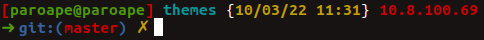

# ParoaPe-zsh-theme

Personnal zsh theme based on "lpha3cho Oh-My-Zsh theme for pentesters".

This is a modified version of the intheloop theme, with date, time, and IP address added for penetration testing logging.

If you're not already using Zshell, install it `sudo apt install zsh` then switch to it by opening a terminal and enter: `chsh -s $(which zsh)`.Logout and login.
Don't forget to copy anthing impotant like aliases over from `~/.bashrc` to `~/.zshrc`. Note: Kali Linux uses Zshell by default.

Install [Oh My Zsh](https://ohmyz.sh/):
`sh -c "$(curl -fsSL https://raw.githubusercontent.com/ohmyzsh/ohmyzsh/master/tools/install.sh)"`

Copy the file ParoaPe.zsh-theme to `~/.oh-my-zsh/themes` and set the theme in `~/.zshrc` to: `ZSH_THEME="ParoaPe` (line 11).

By default it's configured to include the IP address of eth0 for Internal network pentests, so change the network adapter in line 13 if needed.

For External network pentests, comment out lines 13 and 14, and uncomment lines 16 and 17 to include your Internet IP address in the prompt.

## Enabling Plugins (zsh-autosuggestions & zsh-syntax-highlighting)
- Download zsh-autosuggestions by

 `git clone https://github.com/zsh-users/zsh-autosuggestions.git $ZSH_CUSTOM/plugins/zsh-autosuggestions`

- Download zsh-syntax-highlighting by

 `git clone https://github.com/zsh-users/zsh-syntax-highlighting.git $ZSH_CUSTOM/plugins/zsh-syntax-highlighting`

- `nano ~/.zshrc` find `plugins=(git)`

- Append `zsh-autosuggestions & zsh-syntax-highlighting` to  `plugins()` like this:

 `plugins=(git zsh-autosuggestions zsh-syntax-highlighting)`

- Reopen terminal
